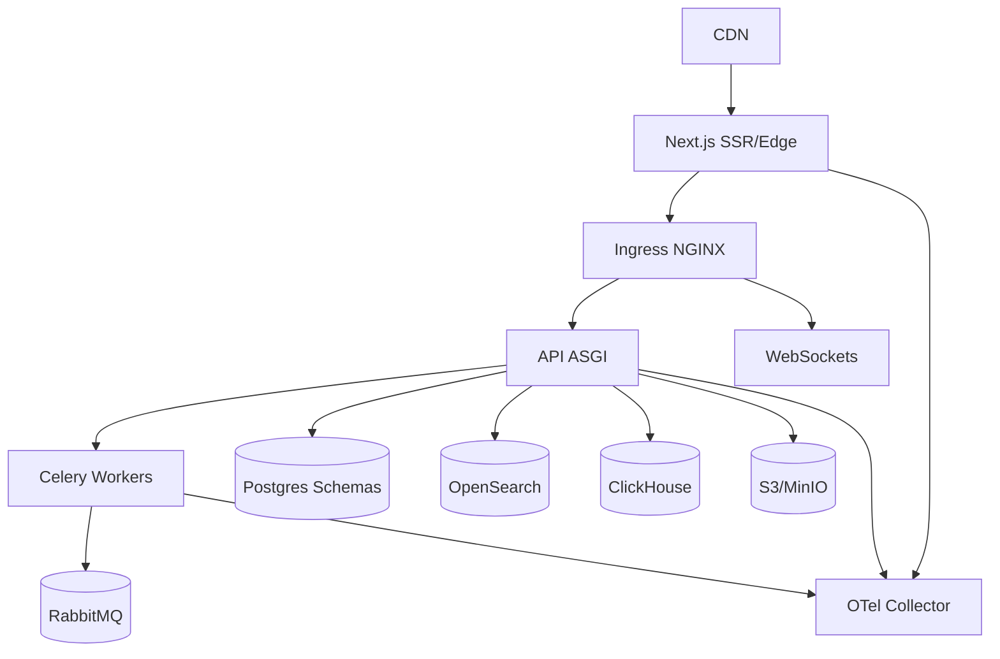

# Arquitetura GhitDesk

## Visão Lógica

```mermaid
flowchart LR
  subgraph Client[Clientes (Tenants)]
    T1[tenant: org A]
    T2[tenant: org B]
  end

  subgraph Web[apps/web (Next.js - App Router)]
    BFF[Route Handlers / BFF]
    MW[Middleware (CSP/Auth)]
    UI[Agente/Admin UI]
  end

  subgraph API[apps/api (Django + DRF + Channels)]
    Auth[OIDC/JWT]
    Ten[django-tenants]
    WS[Channels/WebSocket]
    Cel[Celery Workers]
    Hook[Webhooks]
  end

  subgraph Data[Camada de Dados]
    PG[(Postgres+pgvector\\npor schema/tenant)]
    OS[(OpenSearch\\ntexto+vetor)]
    CH[(ClickHouse\\nOLAP)]
    S3[(MinIO/S3\\nanexos)]
    Redis[(Redis\\ncache/sessões)]
    RMQ[(RabbitMQ\\nfilas)]
  end

  subgraph IA[Ghoat (LLM + RAG)]
    vLLM[vLLM Server]
    RAG[Retriever pgvector/OpenSearch]
  end

  subgraph Ext[Plataformas Externas]
    WA[WhatsApp Cloud API]
    IG[Instagram/Messenger]
  end

  T1--subdomínio/domínio-->MW
  T2--subdomínio/domínio-->MW

  UI--SSR/CSR-->BFF
  BFF--REST/WS-->API
  MW--guards-->BFF

  API--ORM-->PG
  API--indexação-->OS
  API--eventos-->CH
  API--cache-->Redis
  API--tarefas-->Cel
  Cel--filas-->RMQ
  API--anexos-->S3

  API--webhooks assinados-->Ext
  Ext--eventos-->Hook

  API--prompts/contexto-->RAG
  RAG--consulta-->PG
  RAG--consulta-->OS
  RAG--chamadas-->vLLM
  vLLM--respostas-->API
```

## Diagrama de Deploy



## Mantra Operacional

- Dados de clientes são protegidos com isolamento por schema, chaves KMS e governança LGPD.
- Observabilidade desde o primeiro deploy com OTel coletando traces, métricas e logs padronizados.
- Picos são normais: HPA, filas e backpressure em todos os serviços.
- Automação transparente: IA sempre explica o motivo das sugestões e referencia a fonte do RAG.
